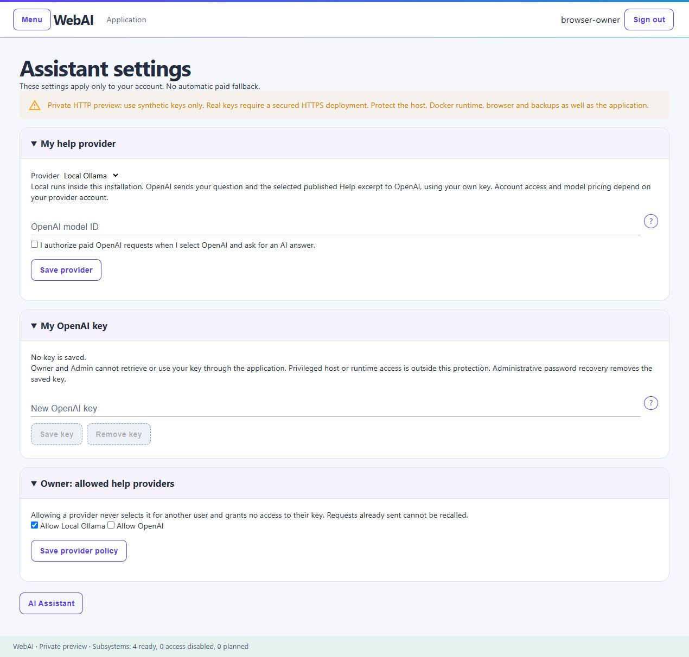

# AI Assistant

The AI Assistant answers questions about the workspace and current subsystem using packaged Help available to your role. It is not a general chat agent or a way to execute application operations.

## AI Assistant in use

The master Assistant searches authorized Help across subsystems. This user-supplied evaluation screenshot shows Files and Folders and Write a Book answers on the same page, with clearly distinguished **Read Help** links. Answers explain the workflow; they do not perform the operations. Generated guidance can be incorrect, so check the linked Help when a detail matters.

## Choose a response mode

- **Help-only** uses published Help without AI generation.
- **Local** uses the included AI model when allowed and available. No paid API request is made.
- **OpenAI** uses your own saved key and selected model when the Owner allows this provider and you explicitly choose paid use. Your provider can charge for requests.

Local is enabled and OpenAI disabled by default. There is no automatic paid fallback. If a mode cannot answer, do not assume another paid service was contacted. Each question is independent; the page retains up to six answers until you leave or clear it.

## Ask a question

The master page, **Ask about this software**, searches all published Help available to your role and enabled subsystems. Subsystem pages name their scope, such as **Ask about Document Library**, and search that subsystem's Help plus account guidance. Automatic selection is the default; choosing a topic supplies a hint rather than forcing an unrelated answer.

Type a non-empty question. **Ask** becomes available while typing, subject to request availability. Relevant excerpts are selected from the authorized collection rather than sending every Help page with every question. Answers include clearly styled **Read Help** links when appropriate. If no relevant guidance is found, the Assistant says so instead of displaying unrelated account instructions. Search relevance is currently English-oriented and can miss unusual wording; generated answers still require judgment.

Generated answers can be wrong. Check the application Help when a detail matters. An explanation is not evidence that an action has been performed. The Assistant cannot read your documents or mounted files, query application records, run commands or change data.

## Set up OpenAI

Open **AI Assistant → Assistant settings**. The settings panels start collapsed; select a panel heading to expand it.

1. **Owner enables the option:** expand **Owner: allowed help providers**, select **Allow OpenAI**, then **Save provider policy**. This makes the option available without selecting it or charging anyone.
2. **Each user saves their own key:** expand **My OpenAI key**, enter the key privately and choose **Save key**. The application does not display it again.
3. **Each user chooses paid use:** expand **My help provider**, select **OpenAI (paid)**, enter an available model ID compatible with the Responses API, select the paid-request authorization checkbox and choose **Save provider**.
4. Return to **AI Assistant**, leave **Use my selected provider for this question** checked and ask a Help question. Uncheck it to read Help without an AI request.

If OpenAI is disabled in the provider list, ask the Owner to allow it. Saving settings or a key does not itself make a paid request. Select **Local** or **Help-only** to stop using OpenAI for subsequent questions; there is no automatic paid fallback.

**HTTP does not protect API keys between your browser and WebAI.** IP-only HTTP supports local or LAN installation, but an external HTTPS gateway is recommended before entering real credentials over a shared/untrusted network. Outbound HTTPS to an AI provider does not encrypt the browser connection. See [connection setup](HTTPS-SETUP.md).

The screenshot uses a synthetic account with no saved key. OpenAI is disabled until the Owner allows it.

## Your OpenAI key

Each account supplies its own key. It is encrypted server-side and is not displayed again through application interfaces. Owner and Admin cannot retrieve or use another account's key through the application. Administrative password recovery clears the saved provider key.

Deleting a stored key does not revoke it at the provider. Revoke a compromised key there as well. A request already sent cannot be recalled. Never paste keys, passwords or private documents into a question, issue or screenshot.

OpenAI requests transmit your question and selected Help context to OpenAI. API charges are separate from WebAI. See [evaluation limitations](EVALUATION.md) for the current verification coverage.

## Document Library Data Search

Open **Document Library → Data Search** to use **Search Document Library**. Help and Data Search remain separate: Help explains the software; Data Search retrieves authorized records. This guide describes WebAI v0.9.2-preview.1; the older v0.7.1 download does not contain these search features.

### Search without sending documents to a model

Enter **Search words** and choose **Search** for a model-free search. Alternatively, enter **Your search question**, choose an available **Question interpreter**, and request interpretation. Review the resulting search words: the model may misunderstand your question.

The interpreter receives your question, not document titles, contents, excerpts or results. Application code validates the returned search plan, applies your access permissions, searches current Library revisions and formats the results. There is no model-written SQL, second model call to summarize documents, automatic paid fallback or source-data modification.

Supported text is UTF-8 plain text and Markdown; other formats have title-only coverage. There is no PDF/Office extraction, OCR, semantic similarity search or cross-subsystem search in this pilot. An empty result does not prove the document does not exist. Keyword search requires matching terms; changing only the saved question does not change its search words.

### Choose the connection

| Choice | Requirements | What is sent externally? |
| --- | --- | --- |
| Local model | Local service enabled and Owner allows local use | Nothing sent to a paid provider |
| My OpenAI connection | Your saved key, OpenAI Help preference/model and paid authorization; Owner allows OpenAI; operator enables paid search and sets a personal limit | Your question and fixed interpretation instructions |
| System OpenAI connection | Shared key/model/limits configured by Owner or Admin; Owner enables shared search and grants your account access; operator enables paid search | Your question and fixed interpretation instructions |

Personal search currently reuses **AI Assistant → Assistant settings**; it does not yet have independent personal model preferences. Shared search is configured separately under **System Configuration → Search providers**. It does not supply a shared provider to the Help Assistant. An Owner or Admin role does not automatically grant shared paid-search eligibility.

Both paid choices require the **per-question authorization checkbox** on Data Search. It resets after a request or provider change. Saving a key, enabling policy, or granting access makes no provider request. Unavailable choices stay disabled. The shared development preview currently has paid search disabled by the operator, even if a key is configured.

### Shared connection administration

Owner or Admin can save a replacement key, model identifier and daily attempt limits, or confirm removal of the shared key. The key is never displayed again. Only Owner can change the shared-search policy or grant/revoke account eligibility. Each user must still explicitly authorize their own paid question. Removing the shared key leaves personal keys unchanged.

Use a secured HTTPS connection before entering real credentials. Application controls do not protect secrets from a host or Docker administrator; see the security boundary below.

### Usage limits and failures

Limits count **attempts per UTC calendar day**, not tokens or money. Personal and shared attempts are counted separately. Shared use has both a per-account and a system-wide ceiling. Failed or cancelled requests can consume a reserved attempt; there is no automatic refund. Lowering a limit does not erase attempts already counted that day.

A count limit cannot guarantee a currency budget. Configure appropriate spending controls with your provider. A provider error does not trigger a retry or another paid connection automatically. Before manually retrying, remember that an already-dispatched request cannot be recalled and may have incurred a charge. Revoking access blocks subsequent requests and can withhold an in-flight result, but cannot undo a request already sent.

### Save and reuse searches

**Save question** stores the name, original question, search words and filters—not a result. On **Document Library → Data Search**, expand **Saved questions** to edit or **Rerun and save**, and **Saved results** to view earlier snapshots. Rerunning searches using the stored words without another model call and creates a dated result snapshot. Editing the question leaves earlier snapshots unchanged. Views and exports recheck access and withhold documents you can no longer read. The pilot limits each account to 100 saved questions and 100 result snapshots; snapshots contain the first result page, not an unlimited export.

Results can be exported as Markdown or text, or opened in the print view for browser **Save as PDF**. These operations do not call a model or change source documents.

### Verification boundary

Private and shared search paths have passed synthetic service, endpoint and browser checks. No live paid-provider request has been made in this verification. Real credentials, model compatibility, billing, latency and live model quality remain unverified. Broader data assistance and data-changing operations are future work, not capabilities unlocked by supplying a key.

## Search across your working subsystems

Each installed working subsystem has its own search scope; Help remains separate.

| Search page | What it searches |
| --- | --- |
| Document Library | Accessible current document titles and supported text, with its existing saved searches and exports. |
| Write a Book | Your current saved manuscript titles, notes, chapter titles and chapter text. Unsaved edits and historical revisions are excluded. |
| Files and Folders | Names and relative paths inside a selected authorized folder, plus optional UTF-8 `.txt`, `.md` and `.markdown` content. |
| Email | Your selected mail account and folder, within the displayed latest-5,000-UID window. |

For books and files, **Interpret question** makes one question-only model request. Review the resulting keywords, then select **Search**. Manual keywords require no model. Results are formatted by WebAI, not generated from private source content by AI. Source links open in another tab so the search stays available.

Files search does not follow links, create mounts, extract archives, perform OCR or scan the whole server. Its per-scan limits are 2,000 entries, 16 subfolder levels, 256 entries per folder, 1 MiB per text file and 8 MiB of text. A 10-second scan budget is checked between entries; a slow underlying filesystem operation can take longer. Unsupported formats are name/path-only; skipped entries or content produce a partial-coverage notice. Pagination performs fresh bounded scans.

Books and files use case-insensitive literal keyword matching: all search words must occur in the searched section or file/path. Question interpretation helps choose keywords; it does not perform semantic similarity search. Review or simplify the keywords if the expected item is not found.

The **Saved Searches** panel on the Books and Files **Data Search** pages lets you save a question and filters, load and edit them, rerun without AI, and keep dated first-page result snapshots. Library has **Saved questions** and **Saved results** panels on its Data Search page. These three subsystems have no separate Saved Searches submenu. Email retains its Saved Searches menu entry. Books, Files and Mail share a limit of 100 saved questions and 100 snapshots per account; each snapshot holds up to 25 results. Editing question wording does not automatically reinterpret its filters. Deleting a question also deletes its snapshots after confirmation, never source data.

Views and exports recheck access. Changed manuscript revisions or file fingerprints are withheld. Email snapshot views, exports and print views make a read-only connection to check the same folder identity and current first-page matches; older or no-longer-matching messages can be withheld. Authentication failures are not automatically retried. Exports support Markdown, plain text and a print-friendly page for browser **Save as PDF**.

The isolated MCP endpoints expose only their functional search capabilities: `/mcp/books-search`, `/mcp/files-search`, `/mcp/mail-search`, and the existing `/mcp/library-search`. They do not expose source-data writes, arbitrary SQL or arbitrary filesystem commands. External MCP clients control their own use of returned data; WebAI's question-only guarantee does not control an external client's model.

## Security boundary

Write-only application access does not protect a key from someone controlling the host, Docker runtime or process memory, or possessing both the database and encryption keyring. Protect the surrounding environment and backups as described in [Security](SECURITY.md).

[Return to overview](README.md)
