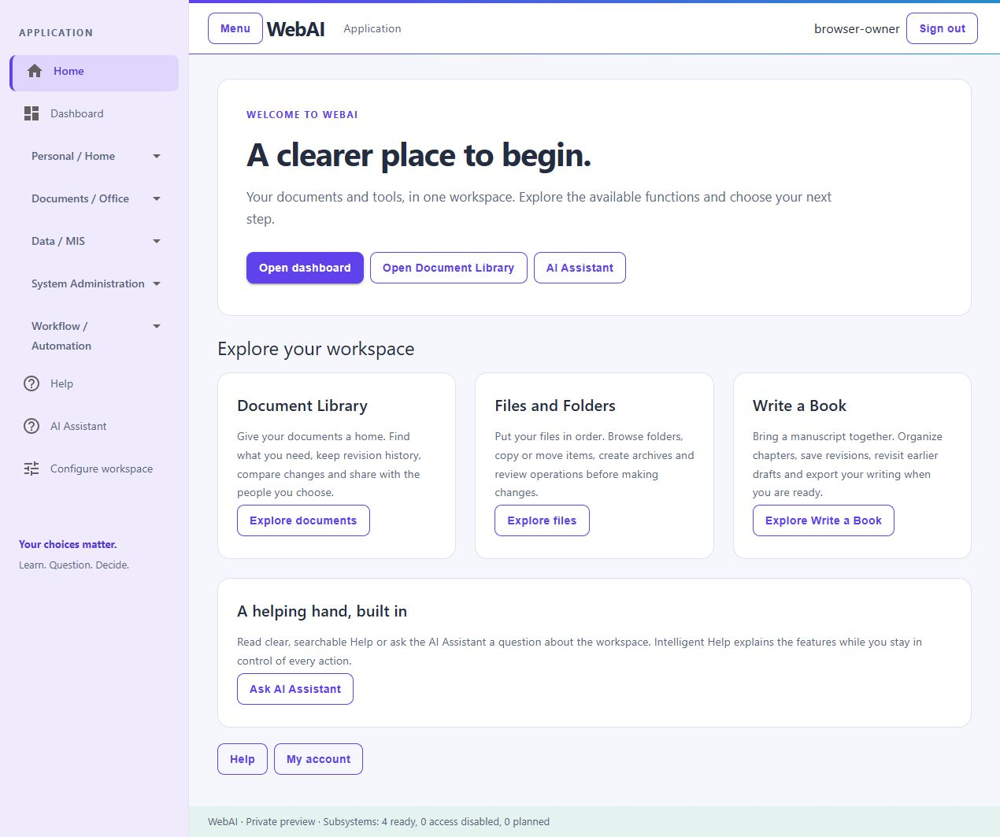
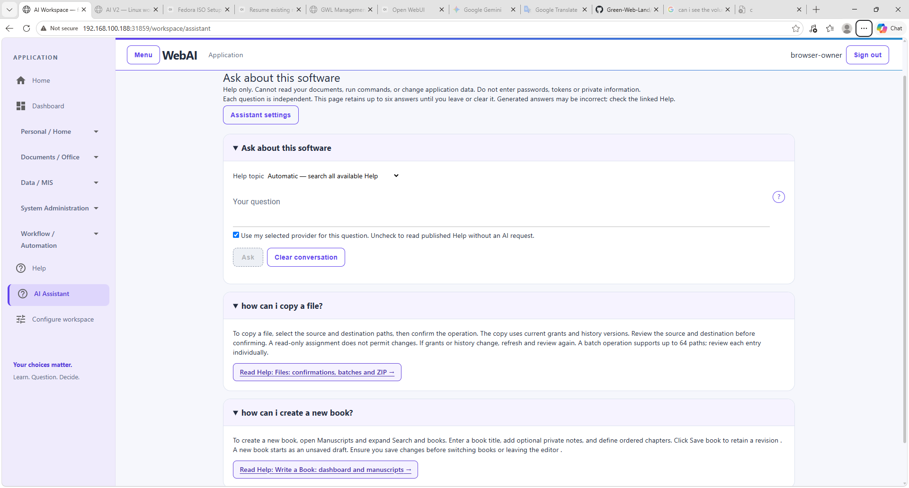
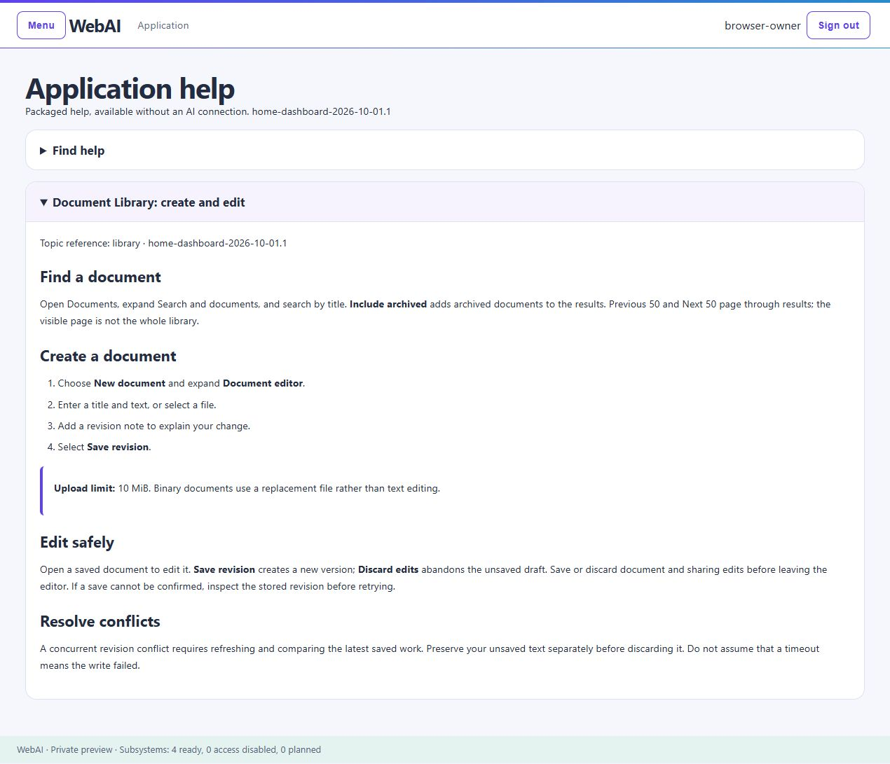

# WebAI

**Your documents, your files, your ideas — one workspace to bring them together.**

WebAI gives everyday work a clear home. Organize documents, manage files, shape a manuscript and find guidance without leaving your workspace. A familiar browser interface puts the next step within reach, while revision history and explicit confirmations help you stay in control.

[Explore the features](#explore-your-workspace) · [Meet AI Assistant](AI-ASSISTANT.md) · [Read the user guide](USER-GUIDE.md) · [Help shape WebAI](EVALUATION.md)

## A look at WebAI

An actual screenshot of the evaluation workspace using a synthetic account. Home introduces the features; the separate Dashboard brings together availability and the subsystem summaries you are authorized to see.

## Explore your workspace

### Document Library

**Give your documents a home, without losing their story.**

Create or upload documents, find them by title and return to earlier revisions when you need context. Compare changes, archive finished material and use sharing controls to work with others. A document's history stays separate from the draft you are editing, so you can review before deciding what to save or restore.

[Explore Document Library in the guide](USER-GUIDE.md#document-library)

### Files and Folders

**Less searching, more getting things in order.**

Browse folders, copy or move items, create archives and review extraction before it changes your workspace. Batch operations help with related items; confirmations make the source and destination explicit. Optional operator-mounted folders can connect selected existing files to the workspace without opening the entire host filesystem.

[Explore Files and Folders in the guide](USER-GUIDE.md#files-and-folders)

### Write a Book

**Turn separate chapters into a manuscript you can follow.**

Create a book project, organize chapters and save your progress as revisions. Revisit previous drafts without replacing the current one, then export saved writing as text or Markdown. Keep the focus on your own work: manuscripts are private to their account.

[Explore Write a Book in the guide](USER-GUIDE.md#write-a-book)

### AI Assistant and built-in Help

**A helping hand when the next step is not obvious.**

Read searchable Help, keep several topics open together, or ask AI Assistant a question about the current subsystem. Intelligent Help uses the application's published guidance to explain features. You remain responsible for the actions: it does not read your private documents, run commands or change application data.

Use built-in Help without a model, local intelligent Help without paid API requests, or an optional OpenAI connection with your own key. There is no automatic switch to a paid provider.

[How AI Assistant works](AI-ASSISTANT.md)

### Guidance inside the application

Read clear steps without leaving WebAI. Select several Help topics to compare them, or collapse a topic when you have finished reading.

## Make the workspace yours

- **Choose what you see.** Grouped, collapsible navigation and personal menu preferences keep the workspace manageable.
- **Open details when needed.** Expand operation panels, explore field guidance and review confirmations before a change.
- **Use your own language.** Import a custom interface translation for your account, with English fallback. No paid translation service is required.
- **Pick up where you left off.** Your sign-in is remembered across browser restarts. Sign-out and security revocation still apply; clearing browser data or browser storage limits can require signing in again.
- **Keep an overview.** The master and subsystem dashboards summarize authorized information without replacing the underlying pages.

## Run it in your own environment

WebAI is **proprietary, not open source**, and free for your own personal or internal business use. Resale, paid hosting and paid support require the publisher's written permission and a commercial agreement. [About and usage policy](ABOUT.md).

WebAI is designed as a downloadable, self-contained Linux container, not a hosted subscription workspace. It includes an internal relational database and a local AI model for intelligent Help. You do not need a paid AI connection to explore the core experience.

You control the installation and its surrounding environment. Protect the host, browser, network and backups; container packaging does not make those responsibilities disappear. A software image is not a backup of work saved after installation.

[Installation and recovery](INSTALLATION.md) · [Security boundaries](SECURITY.md)

## Try the evaluation demo

**Downloads are not available yet.** Follow [WebAI releases](https://github.com/Green-Web-Land/WebAI/releases) for downloadable versions and their installation instructions. WebAI runs in your own environment; it is not a hosted service.

When the demo is available, start with a small, synthetic project: create a document and revise it, organize a few sample files, outline a short book, then ask Help about a feature. Tell us where the experience feels clear — and where it could be better.

The demo is for evaluation, not critical data or production use. [Read the evaluation limitations](EVALUATION.md) before using it.

## Help shape WebAI

Useful feedback comes in many forms: a reproducible defect, a clearer label, a translation that reads naturally, or an idea grounded in an everyday task. We welcome thoughtful suggestions that help make the workspace easier to understand and use.

Use this repository's Issues for non-sensitive feedback. Never attach credentials, private documents or runtime backups.

[Contribution guidance](EVALUATION.md#report-a-defect) · [Translation suggestions](EVALUATION.md#suggest-translations) · [User guide](USER-GUIDE.md) · [About and support](ABOUT.md)
